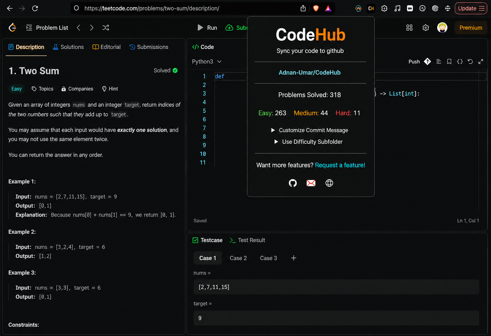

<div align="center">
    
</div>

<p align="center">
  <a href="https://github.com/Adnan-Umar/CodeHub/blob/main/LICENSE">
    
  </a>
  <a href="https://github.com/Adnan-Umar/CodeHub/graphs/contributors" alt="Contributors">
    
  </a>
</p>

## What is CodeHub?

CodeHub is a Chrome extension that automatically pushes your accepted coding solutions to GitHub. Each platform is organized into its own folder inside your repository:

| Platform | GitHub folder |
|----------|---------------|
| LeetCode / LeetCode CN | `LeetCode/` |
| HackerRank | `HackerRank/` |
| GeeksForGeeks | `GeeksForGeeks/` |
| Coding Ninjas / Code360 | `Code360/` |

If a platform folder does not exist yet, CodeHub creates it before uploading your solution.

CodeHub is forked from [CodeHub](https://github.com/Adnan-Umar/CodeHub) and extended with multi-platform support.


## Why CodeHub?

There's no easy way of accessing your solved problems from multiple coding platforms in one place. Pushing code manually to GitHub after every submission is time consuming. CodeHub automates that workflow so you can focus on solving problems.


## Screenshot

<h1 align="center">
    
</h1>


## Supported Platforms

- **LeetCode.com** (English)
- **LeetCode.cn** (Chinese / 力扣)
- **HackerRank**
- **GeeksForGeeks**
- **Coding Ninjas / Code360**


## Supported LeetCode UI

CodeHub works with two different LeetCode UIs. There are known issues when using the plugin with the "non-dynamic layout". Please use one of the following:

1. **old layout** or
2. new **"dynamic layout"**


## Manual synchronization (LeetCode)

Your submission may not be successfully uploaded to GitHub if you update the text in the editor too fast. Wait for the upload spinner to finish before editing, switching languages, or switching editors.

A manual **Push** button is available next to the notes icon on LeetCode. Use it after a successful submission, or select a previous submission and push it to GitHub.


## Installation

1. **Chrome Web Store** *(when published)*

    Install from the Chrome Web Store for automatic updates.


2. **Manual installation**

    * Create your own OAuth app in GitHub (https://github.com/settings/applications/new) and store `CLIENT_ID` and `CLIENT_SECRET` confidentially
        * Application name: CodeHub
        * Homepage URL: https://github.com/Adnan-Umar/CodeHub
        * Authorization callback URL: https://github.com/
    * Clone this repository or download a release ZIP
    * Run `npm run setup` to install developer dependencies
    * Update `CLIENT_ID` and `CLIENT_SECRET` in `src/js/authorize.js` and `src/js/oauth2.js`
    * Open <a href="chrome://extensions">chrome://extensions</a>
    * Enable **Developer mode**
    * Click **Load unpacked** and select the CodeHub folder


## Setup

1. After installing CodeHub, open the extension popup
2. Click **Authenticate with GitHub**
3. Create or link a repository via **Get Started**
4. Start solving problems — accepted submissions are pushed automatically


## Supported npm commands

```bash
npm run               # Show available commands
npm run setup         # Install dependencies
npm run format        # Auto-format JavaScript, HTML/CSS
npm run format-test   # Test if code is formatted properly
npm run lint          # Lint JavaScript
npm run lint-test     # Test if code is linted properly
```


## Contribution

Pull requests are welcome! If you want a particular feature, [request it here](https://github.com/Adnan-Umar/CodeHub/labels/feature).
